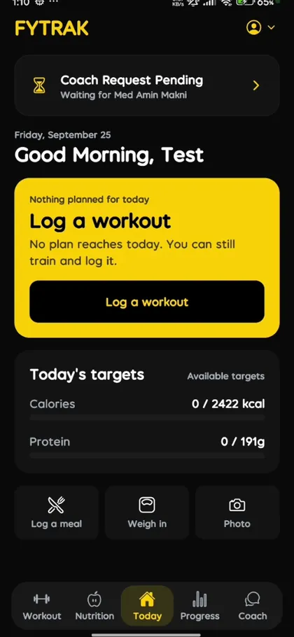
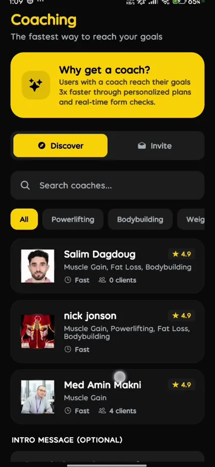
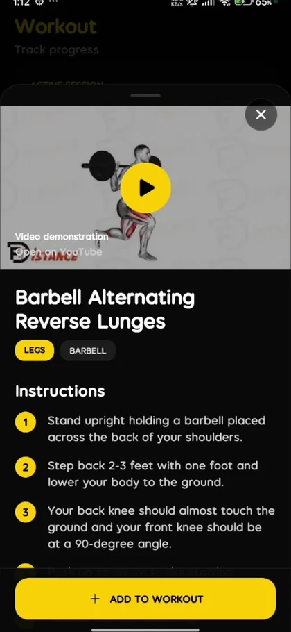
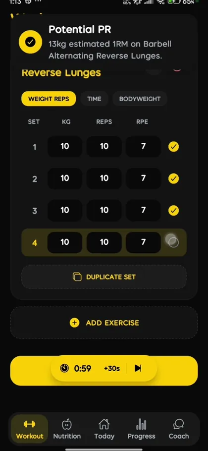
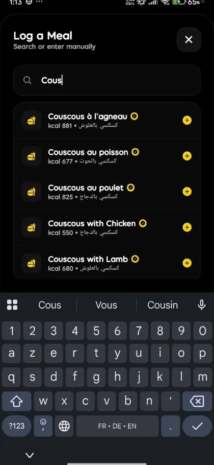
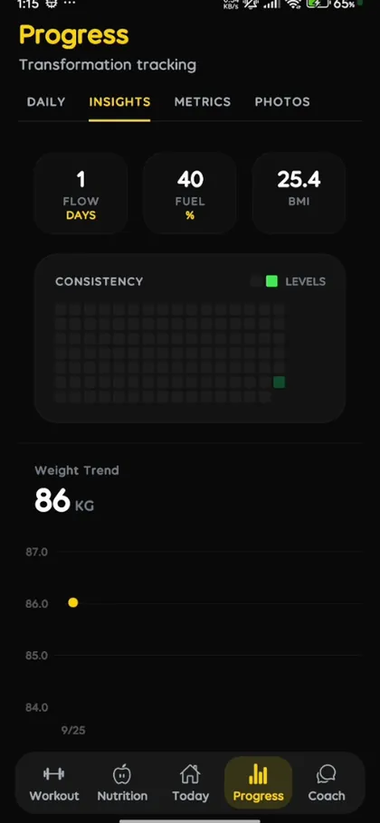
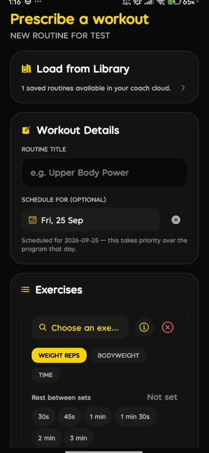
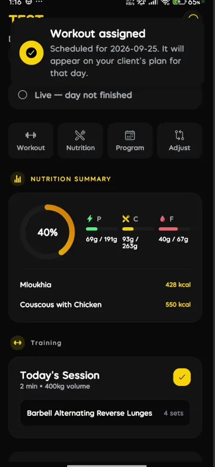
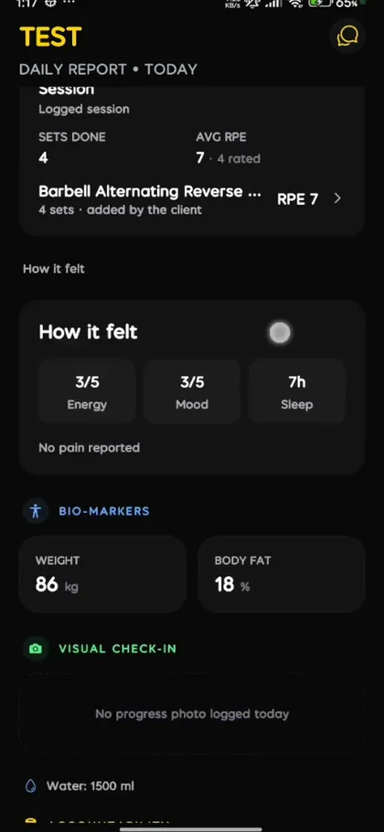

# Fytrak

A coaching platform where a coach and their client run a training programme together — on one app, with an access model strict enough that neither sees what they should not.

Three roles: **trainee**, **coach**, **administrator**. React Native (Expo) on the front, Firebase on the back. Built end to end by one person.

---

## What it does

A trainee signs up, completes an onboarding that sets their calorie budget, and browses coaches. Nothing else starts until a coach accepts the request — the relationship is the gate, not a setting.

Once connected, the trainee logs workouts and meals; the app derives what it can rather than asking for it. A personal record is computed from the logged sets, not typed in. Macros are tracked against the plan the coach assigned.

On the other side, the coach prescribes a workout or a meal and it lands directly in that client's day. Afterwards the coach reads back what actually happened: sets completed, average RPE, reported soreness, sleep, weight and body fat.

| | | |
|---|---|---|
|  |  |  |
| Trainee home — the day's targets, with a coach request still pending | Trainees browse coaches and send a request | Exercise library with form video and instructions |
|  |  |  |
| A PR is derived from the logged sets | Meal logging on a localised food database | Consistency, weight trend and BMI over time |
|  |  |  |
| Coach side — build a routine, sets, reps and RPE | It lands straight in the client's day | and the coach reads back RPE, soreness and bio-markers |

---

## Why it is built this way

**The security rules are the product, not a deployment detail.** A coaching app is a place where one person can read another person's body-composition history, meals and medication list. Getting that wrong is not a bug, it is a harm. So the access model lives in `firestore.rules` — 698 lines of it — and there is a script that runs those rules against the Firebase emulator to check that the boundaries actually hold, rather than trusting that they read correctly.

**Aggregates are written, not computed on read.** Daily totals, streaks and summaries are maintained by Cloud Function triggers at write time. A client's dashboard should not cost a fan-out read every time it opens.

**The app derives what it can.** A trainee entering their own personal record is a trainee guessing. The estimated 1RM comes from the sets they logged.

**Localisation is not an afterthought.** English, French and Arabic, including right-to-left layout, and a food database with dishes people here actually eat.

---

## Architecture

```
apps/mobile       React Native (Expo) — trainee and coach in one app, role-routed
apps/admin-web    Admin console — coach verification and moderation
apps/functions    Cloud Functions (15)
firestore.rules   Access model, 698 lines
packages/shared   Shared types and constants
```

**The 15 Cloud Functions** fall into four groups:

- *Assignment lifecycle* — `requestCoachAssignment`, `resolveCoachRequest`, `cancelCoachAssignmentRequest`, `endCoachAssignment`
- *Write-time aggregation* — `onWorkoutWritten`, `onMealWritten`, `onMetricWritten`, `onWaterWritten`, `onProgressPhotoWritten`, `rebuildClientSummary`
- *Coaching loop* — `onChatMessageCreated`, `markCoachThreadRead`, `markDailyReportReviewed`
- *Scheduled and external* — `sweepDailyReportsToPending`, `revenueCatWebhook`

**Stack:** TypeScript · React Native (Expo) · Firebase Auth, Firestore, Cloud Functions · Cloudinary for image attachments · RevenueCat for subscriptions · i18n with RTL.

---

## Demo

A 90-second walkthrough of both sides of the loop: [`demo/fytrak-demo-90s.mp4`](demo/fytrak-demo-90s.mp4).

---

## Status

Personal project, actively developed. Not an installable release yet.

## Licence

[AGPL-3.0](LICENSE). The author retains copyright; see [NOTICE](NOTICE) for commercial licensing.

Built by [Mohamed Amin Makni](https://www.linkedin.com/in/makni-med-amin/).
